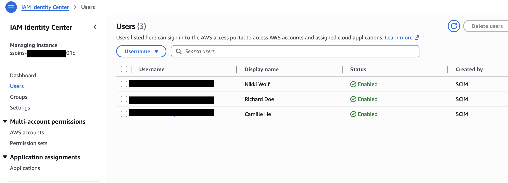
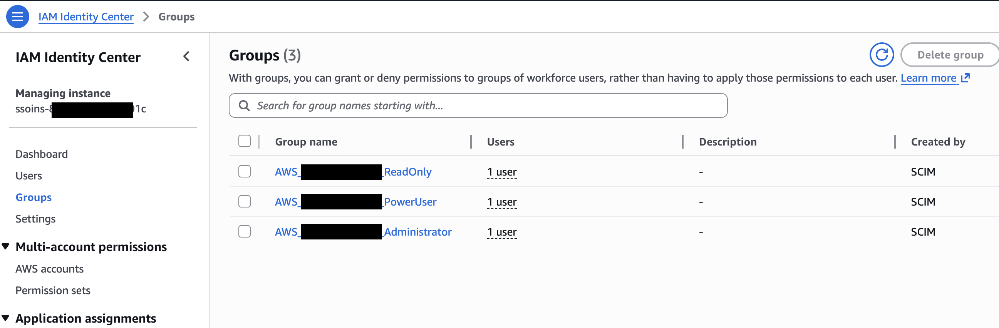
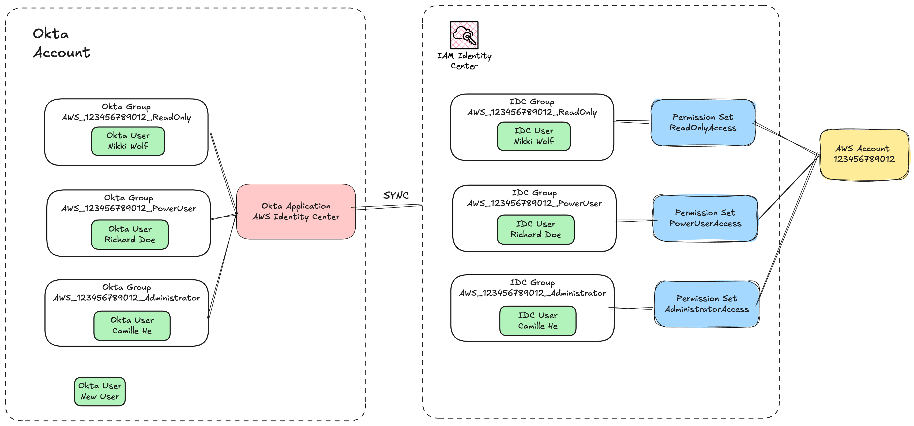

# Okta Integration with AWS IAM Identity Center (SAML + SCIM) Step-by-Step Configuration Guide

## Overview

This document outlines end-to-end configuration for integrating **Okta (Identity Provider / IdP)** and **AWS IAM Identity Center** via SAML-based Single Sign-On (SSO) plus automated user & group provisioning through SCIM. The deployment workflow is split into three core phases:

1. Create a SAML application within Okta.
2. Configure external identity source and SCIM on AWS.
3. Final Okta setup and triggering provisioning sync, followed by full validation test procedures.

## Step 1: Create SAML Application on Okta and Export IdP Metadata

> Setup an Okta account if you don't have one follow [this guide](./okta-account-setup-guide.md).

1. Log in to the Okta Admin Console, navigate to `Applications > Applications`, then click **Browse App Catalog**.
2. Search for **AWS IAM Identity Center**, select **Add Integration** and click **Done** to add the target application to your Okta tenant.
3. Open the application’s **Sign On** tab and locate the `SAML Signing Certificates` section.
4. Click `Actions` → **View IdP Metadata**. An XML metadata file will open automatically in your browser; save the file locally as `metadata.xml` for later use.

## Step 2: Configure External Identity Source and SCIM in AWS IAM Identity Center

### 2.1 Switch Identity Source and Upload IdP Metadata

1. Sign into the AWS Management Console and open **IAM Identity Center**. Click **Go to Settings** at the top-right corner to access the Settings page.
2. Under the `Identity source` section, select `Actions` → **Change identity source**.
3. Choose **External identity provider** to enter the configuration page.
4. Copy and safely store the three URLs under `Service provider metadata`:
    - AWS access portal sign-in URL
    - IAM Identity Center ACS URL
    - IAM Identity Center issuer URL
5. In the `Identity provider metadata` field under `IdP SAML metadata`, click **Upload metadata** and upload the `metadata.xml` file exported from Step 1.
6. Enter `ACCEPT` in the confirmation input box and click **Change identity source** to complete identity source migration.

### 2.2 Enable SCIM and Retrieve Provisioning Credentials

1. Stay on the IAM Identity Center **Settings** page, find `Automatic provisioning` and click **Enable**.
2. Copy the below parameters in the pop-up window (**the Access token is only displayed once; back it up immediately**):
    - SCIM endpoint
    - Access token
3. Click **Close** after credential backup is finished.

## Step 3: Complete Okta Backfill Configuration, Enable SCIM and Trigger User/Group Sync to AWS IAM Identity Center

### 3.1 Populate SAML Endpoint Details

1. Return to the target AWS IAM Identity Center application on Okta and open the **Sign On** tab, then click **Edit**.
2. Fill in the URLs copied from AWS side:
    - ACS URL: Paste the copied `IAM Identity Center ACS URL`
    - Issuer URL: Paste the copied `IAM Identity Center issuer URL`
3. Save the updated settings.

### 3.2 Configure SCIM API Endpoint and Authorization Token

1. Switch to the **Provisioning** → **Integration** tab and select **Configure API Integration**.
2. Check the box for **Enable API integration**, then input the following values:
    - Base URL: Paste the copied `SCIM endpoint` (**remove trailing slash from the URL**)
    - API Token: Paste the AWS-generated `Access token`
3. Click **Test API Credentials**. After successful credential verification, click **Save**.

### 3.3 Create Test Users and Groups

> Skip to next step if test users and groups already exist in Okta.

#### Create Users

Navigate to `Directory` → `People` → `Add People` on the left sidebar, in the pop-up window, fill in required user details to create test users. New users must reset their passwords to reach an **Active** status; create multiple test users per your validation needs:

| First Name | Last Name | Username (login)          |
| ---------- | --------- | ------------------------- |
| Nikki      | Wolf      | <nikki.wolf@example.com>  |
| Richard    | Doe       | <richard.doe@example.com> |
| Camille    | He        | <camille.he@example.com>  |

> Test users' emails must be unique and validated in order to pass the whole validation process.

#### Create Groups

Navigate to `Directory` → `Groups` → `Add Group` to create user groups. There are two default Groups created by Okta: `Everyone` and `Okta Administrators`. For demonstration purposes, we create new groups as below:

- `AWS_123456789012_ReadOnly`
- `AWS_123456789012_PowerUser`
- `AWS_123456789012_Administrator`

> Naming convention recommendation: prefix group names with `AWS_`, then include AWS account ID and permission scope to avoid confusion.

For new created group, there is 0 people in the group, and 0 applications assigned to the group. Next step, we will assign users and applications to the groups.

### 3.4 Assign Users & Groups to Trigger SCIM Synchronization

1. Open the newly created group, go to the **People** tab and click **Assign people** to attach existing Okta users to the group. A group must contain at least one member to be synced to AWS. For example:

    | User Name   | Group Name                     |
    | ----------- | ------------------------------ |
    | Nikki Wolf  | AWS_123456789012_ReadOnly      |
    | Richard Doe | AWS_123456789012_PowerUser     |
    | Camille He  | AWS_123456789012_Administrator |

2. On the same group page, switch to the **Applications** tab and click **Assign applications** to bind the **AWS IAM Identity Center** app to this group; repeat for all prepared groups.

3. Navigate to `Applications > Applications`, click on **AWS IAM Identity Center** application, open **Push Groups**. Select either **Find group by name** or **Find group by rule**, tick target groups for sync and click **Save**. Wait several minutes then verify corresponding groups appear within AWS IAM Identity Center.

In  AWS IAM Identity Center console, click on `Users` and `Groups` tab in the left sidebar, the three test users and groups are synced from Okta.

## Step 4: Assign Permission Sets to Synced Groups in AWS IAM Identity Center

In order to grant user access to AWS resources, we need to create a few permission sets and assign them to the synced groups as below. Since the permission sets are AWS resources, we use Terraform script to define and create these permission sets in the repository `terraform/identity-center` folder.

As designed, for each AWS account, we created three groups with different permission scopes: `ReadOnly`, `PowerUser`, and `Administrator`. For group with permission scope `ReadOnly`, we assign the permission set `ReadOnlyAccess`, and the same for `PowerUser` and `Administrator`.

Navigate to `IAM Identity Center` → `AWS accounts`, click the target AWS account. In `Users and groups` tab, click `Assign users or groups`.

- Select group `AWS_123456789012_ReadOnly` synced from Okta in `Groups` panel, click `Next`.
- Select permission set `ReadOnlyAccess` in `Permission sets` panel, click `Next`.
- In `Review and subnet` view, review the assignment details. The group and permission set must match its permission scope (`ReadOnlyAccess`).
- Click `Submit` to finalize the assignment.
- Repeat the process for `PowerUser` and `Administrator` groups.

After done, verify the permission sets are assigned to the groups for target account as below:

| Username / group name          | Permission sets     | Type  |
| ------------------------------ | ------------------- | ----- |
| AWS_123456789012_ReadOnly      | ReadOnlyAccess      | Group |
| AWS_123456789012_PowerUser     | PowerUserAccess     | Group |
| AWS_123456789012_Administrator | AdministratorAccess | Group |

Now, we have setup the relationship between Okta groups and AWS IAM Identity Center groups as below:

When a new user is assigned to an Okta group, the user is automatically synced to AWS IAM Identity Center with the corresponding AWS account permissions.

## Function Validation & Testing

### 1. User Provision Sync Validation

Access permissions are assigned at group level rather than individual user level. User-to-group membership relationships will automatically sync into **Users** and **Groups** directories within AWS IAM Identity Center.
- To grant permissions to new/existing users: add target users into corresponding Okta groups, which triggers automatic sync to AWS user inventory via SCIM.
- To revoke permissions: remove users from relevant Okta groups; SCIM will auto-sync the change and remove the user from the matching AWS IAM Identity Center group.

### 2. SSO Login Validation

Navigate to the `AWS access portal sign-in URL` -> `Dual-stack URL`, log in with valid Okta credentials and confirm successful access to the AWS access portal with assigned resource permissions loaded correctly.

### 3. SCIM Lifecycle Sync Validation

- Update test user attributes (display name, email etc.) on Okta, wait for sync interval and confirm attribute changes propagate to AWS IAM Identity Center.
- Manually delete a synced user inside AWS IAM Identity Center, observe the next scheduled SCIM sync cycle to confirm lifecycle management takes effect.

## Important Notes

- The SCIM `Access token` is only visible at generation time. A new token must be regenerated via AWS automatic provisioning reset if lost.
- Remove trailing slash from SCIM Base URL; trailing slash causes API call failures.
- A normal 1~5 minute propagation delay exists for user/group and attribute synchronization via SCIM.
- All user-group membership and access assignments are managed centrally on Okta; AWS only configures permission sets against synced Okta-originated identities.
