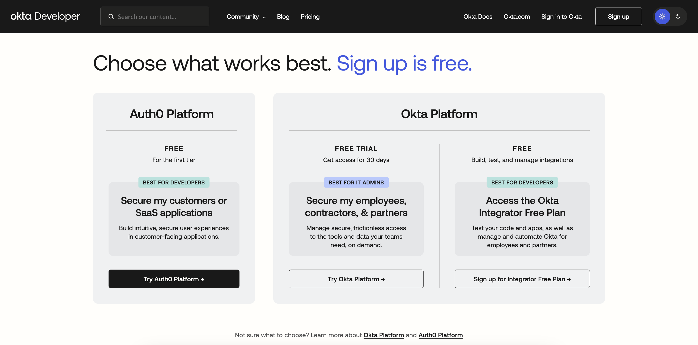
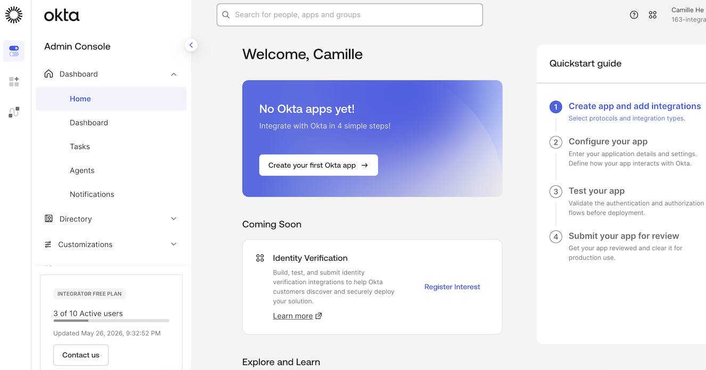

# Set Up Okta Account – Easy & Secure Step-by-Step Guide

## Introduction

Setting up a secure login system is the first step toward protecting applications and user data. Okta provides a **free developer plan** that allows you to test authentication, Single Sign-On (SSO), and user management features. This guide explains how to set up an Okta account step by step with simple language suitable for beginners.

By the end of this guide, you will have:
- A free Okta Developer account
- Access to the Okta Admin Console
- Okta Verify set up for security

## What Is Okta?

Okta is a cloud-based Identity and Access Management (IAM) platform used for:
- Login authentication
- Single Sign-On (SSO)
- User and role management
- Securing web and mobile applications

Okta is widely used by startups and enterprises to manage secure access in one place.

The Okta **Integrator Free Plan** is ideal for developers and students. Understanding how to set up an Okta account helps developers test authentication, enable SSO, and manage users securely in real-world projects.

## Step-by-Step Okta Account Setup

### Step 1: Create a Free Okta Developer Account

1. Open your browser
2. Navigate to: [Okta Developer Signup](https://developer.okta.com/signup/)
3. On the signup page, choose **Okta Platform**
4. Click **Sign up for Integrator Free Plan**

Fill the Signup Form with:
- First Name
- Last Name
- Work Email (company or college email recommended)
- Country/Region

> You can use personal email instead of work email, however most of email providers (outlook, gmail, yahoo, qq) are not supported.

1. Complete the CAPTCHA verification
2. Click **Sign Up**

> Platform Options Note:
> - Auth0 Platform: Free, best for developers securing customer/SaaS applications
> - Okta Platform Integrator Free Plan: Free, for building/testing integrations, managing Okta for employees and partners
> - Okta Platform+ : 30-day free trial for IT admins securing staff/contractor access

### Step 2: Verify Your Email Address

1. After signing up, Okta sends a verification email to your registered inbox
2. Open your email inbox
3. Click **Verify Email**

⚠️ **Email verification is mandatory** to continue the account setup process.

### Step 3: Set Up Your Password

1. After email verification, you will be redirected to Okta
2. Click **Set up** under Password option
3. Create a strong password following Okta password rules
4. Save and continue

This password is used to log in to the Okta Admin Console.

### Step 4: Set Up Okta Verify (Multi-Factor Authentication)

Okta requires Okta Verify for extra account security (MFA setup):
1. Download the **Okta Verify** app
   - Android: Google Play Store
   - iPhone/iPad: App Store
2. On your laptop, Okta displays a QR code
3. Open the Okta Verify app → Tap **Scan a QR code**
4. Scan the on-screen QR code
5. The app generates a verification code
6. Enter the code and click **Verify**

✅ MFA setup is completed successfully.

### Step 5: Access the Okta Admin Console

After all verification steps:
- You will land directly on the Okta Admin Console as below screenshot.
- Manage the following in the console:
  - Users
  - Applications
  - Security policies
  - Authentication methods

Your Okta account is now fully ready for use.

## Conclusion

This guide covers the complete process of setting up an Okta account using the Integrator Free Plan. The workflow is simple, secure, and beginner-friendly.

With your Okta Developer account, you can start:
- Testing authentication flows
- Implementing SSO functionality
- Securing web/mobile applications

Whether you are a student, developer, or IT professional, Okta is a powerful tool for building secure login systems in real-world projects.

## References

- [Okta Developer Signup](https://devopslover.com/how-to-set-up-an-okta-account/)
