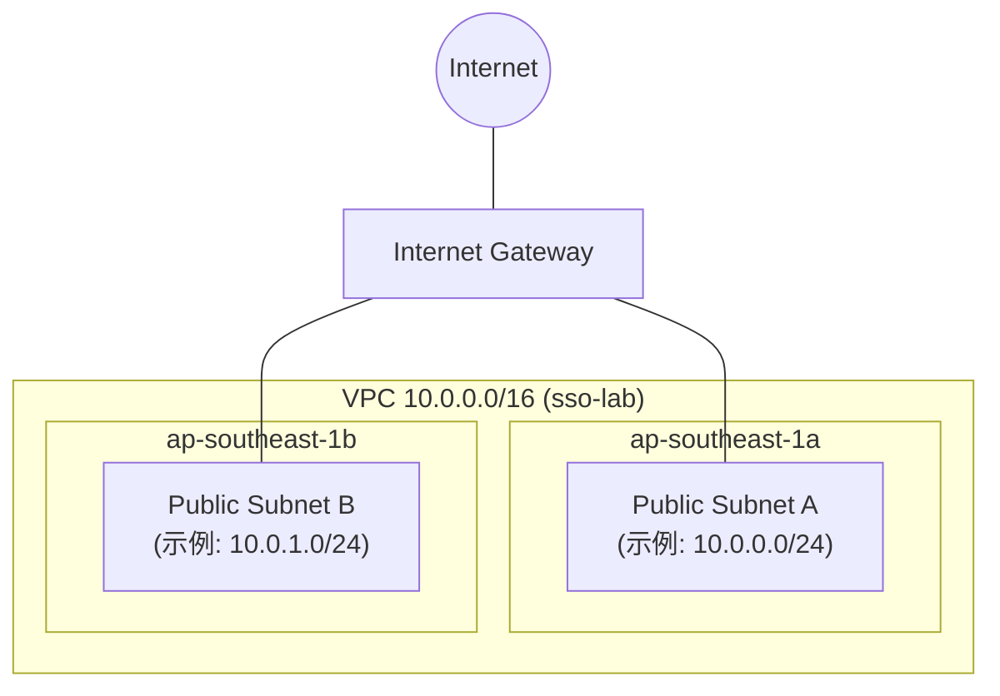

# AWS SSO 与 Active Directory 集成 - 控制台完整操作指南（新加坡区域）

本文档记录了一次完整的 AWS SSO 与 AWS Managed Microsoft AD 集成的实验过程，全程使用 AWS 管理控制台手动操作，区域为 **ap-southeast-1（新加坡）**。

---

## 目录

1. [实验概述](#1-实验概述)
2. [网络环境准备（简化版）](#2-网络环境准备简化版)
3. [创建 AWS Managed Microsoft AD](#3-创建-aws-managed-microsoft-ad)
4. [创建管理 EC2 并加入域](#4-创建管理-ec2-并加入域)
5. [安装 AD 管理工具并创建测试用户](#5-安装-ad-管理工具并创建测试用户)
6. [配置 IAM Identity Center](#6-配置-iam-identity-center)
7. [验证 SSO 登录](#7-验证-sso-登录)
8. [清理资源](#8-清理资源)
9. [常见问题与排错](#9-常见问题与排错)

---

## 1. 实验概述

### 目标

在单个 AWS 账号内模拟企业数据中心 AD 与 AWS SSO 的集成，实现使用 AD 域用户登录 AWS 访问门户并获取 AWS 控制台权限。

### 架构组件

- **AWS Managed Microsoft AD**：模拟企业本地 Active Directory，域名为 `lab.local`
- **EC2 Windows 管理实例**：加入域，用于管理 AD 用户
- **IAM Identity Center (AWS SSO)**：配置 AD 作为身份源，同步用户并分配权限

### 关键账户/密码说明

| 角色               | 用户名                             | 密码来源/说明                                                                             | 用途                                     |
| :----------------- | :--------------------------------- | :---------------------------------------------------------------------------------------- | :--------------------------------------- |
| **EC2 本地管理员** | `Administrator`                    | 通过 EC2 控制台“获取密码” + `.pem` 私钥解密得到，**一次性随机密码**（首次登录后强制更改） | 首次 RDP 连接 Windows 实例               |
| **域管理员**       | `Admin` 或 `lab\Admin`             | 创建 AWS Managed Microsoft AD 时设置的密码（用户自定义，如 `LabP@ssw0rd!2024`）           | 管理 AD 域、创建用户、将 EC2 加入域      |
| **测试域用户**     | `sso-test` 或 `sso-test@lab.local` | 域管理员在 AD 中创建时设置的密码（需符合 AD 复杂性要求，如 `MyP@ssw0rd123!`）             | 模拟普通员工，通过 SSO 登录 AWS 访问门户 |

> ⚠️ **重要区分**：`Administrator` 是 **EC2 实例的本地账户**，仅在实例层面有效。
> `Admin` 是 **整个 AD 域的管理员**，可管理域内所有对象。
> `sso-test` 是普通的 **域用户**，用于 SSO 测试。

---

## 2. 网络环境准备（简化版）

在本实验中，我们使用 AWS 控制台的 **VPC 向导** 快速创建一个包含完整网络组件的 VPC，无需手动逐一创建子网、路由表和互联网网关。

### 2.1 使用“VPC 和更多”快速创建 VPC

1. 进入 **VPC 控制台** → 点击 **创建 VPC**。
1. 在 **创建 VPC** 页面，选择 **VPC 和更多**（VPC and more）。
1. 配置以下参数：

| 参数                 | 值                                           |
| :------------------- | :------------------------------------------- |
| **创建 VPC 的资源**  | VPC 和更多                                   |
| **名称标签自动生成** | `sso-lab`                                    |
| **IPv4 CIDR 块**     | `10.0.0.0/16`                                |
| **IPv6 CIDR 块**     | 无 IPv6 CIDR 块                              |
| **租户**             | 默认                                         |
| **可用区数量**       | 2                                            |
| **公有子网数量**     | 2                                            |
| **私有子网数量**     | 0（本实验不需要私有子网）                    |
| **NAT 网关**         | 无（本实验不需要）                           |
| **VPC 终端节点**     | 无                                           |
| **DNS 选项**         | 启用 DNS 主机名、启用 DNS 解析（默认已勾选） |

1. 点击 **创建 VPC**。

系统会自动创建以下资源：
- 一个 VPC（CIDR `10.0.0.0/16`）
- 两个公有子网（分别位于 `ap-southeast-1a` 和 `ap-southeast-1b`）
- 一个互联网网关（IGW）并自动附加到 VPC
- 一个主路由表，包含指向 IGW 的默认路由，并关联两个公有子网
- 默认安全组（后续可自定义）

### 2.2 网络架构图

以下为该 VPC 的简化网络架构：



> **说明**：本实验中的所有 EC2 实例和 AWS Managed AD 都将部署在这两个公有子网中，并自动获得公网访问能力（通过 IGW）。安全组后续单独配置。

### 2.3 记录资源信息

创建完成后，请记录以下信息（后续步骤需要使用）：
- **VPC ID**：例如 `vpc-xxxxxx`
- **子网 A ID**：第一个子网（`ap-southeast-1a`）
- **子网 B ID**：第二个子网（`ap-southeast-1b`）

可在 VPC 控制台的“您的 VPC”和“子网”页面查看。

---

## 3. 创建 AWS Managed Microsoft AD

### 3.1 创建目录

1. 进入 **Directory Service** 控制台 → **设置目录**
2. 选择 **AWS Managed Microsoft AD**
3. 配置：
   - **目录 DNS 名称**：`lab.local`
   - **目录 NetBIOS 名称**：`LAB`
   - **管理员密码**：`LabP@ssw0rd!2048`（自定义强密码，**记住此密码，这就是域管理员 `Admin` 的密码**）
   - **确认密码**：同上
   - **版本**：Standard Edition
   - **VPC**：选择刚刚创建的 VPC（例如 `sso-lab-vpc`）
   - **子网**：选择之前记录的两个公有子网（A 和 B）
4. 点击 **创建目录**

⏰ 等待约 30–40 分钟，状态变为 **Active**。

### 3.2 记录 DNS 地址

创建完成后，在目录详情页的“联网与安全”部分，记录 **DNS 地址**（两个 IP），后续配置 EC2 DNS 时会用到。

---

## 4. 创建管理 EC2 并加入域

### 4.1 启动 Windows EC2 实例（自动加入域）

1. 进入 **EC2 控制台** → **启动实例**。
2. 配置：
   - **名称**：`AD-Management-Server`
   - **AMI**：Windows Server 2019 Base 或 2022 Base
   - **实例类型**：`t3.micro`
   - **密钥对**：选择现有或新建一个（例如 `sso-lab-key`），**保存好 `.pem` 文件**。
   - **网络设置**：
     - VPC：选择之前创建的 VPC。
     - 子网：选择 **子网 A**（`ap-southeast-1a` 下的公有子网）。
     - 自动分配公网 IP：**启用**。
     - 安全组：新建一个，允许 **RDP (3389)** 入站，源为 **你的公网 IP/32**。
   - **高级详细信息**：
     - **域加入目录**：从下拉列表中选择你的目录 `lab.local`。
     - **IAM 实例配置文件**：选择或创建一个具有 `AmazonSSMManagedInstanceCore` 和 `AmazonSSMDirectoryServiceAccess` 策略的角色。（如果还没有这个角色，控制台会提供链接让你创建，操作很方便。）
3. 启动实例。启动后，实例会自动加入 `lab.local` 域。

### 4.2 获取本地 Administrator 密码

1. 实例启动后，进入 EC2 控制台 → 选中实例 → 点击 **连接** → **RDP 客户端**
2. 点击 **获取密码** → **上传私钥文件**（上传 `.pem` 文件）→ **解密密码**
3. 复制显示的密码（**这是 EC2 本地管理员 `Administrator` 的初始密码**）

### 4.3 在本地电脑安装 Windows App 并 RDP 登录

> 本步骤以 **Mac** 为例，Windows 用户可直接使用“远程桌面连接”程序。

1. **安装 Windows App**：
   - 打开 Mac App Store。
   - 搜索 “Windows App” 或 “Microsoft Remote Desktop”。
   - 点击“获取”或“下载”进行安装（免费）。
2. **添加连接**：
   - 打开 Windows App。
   - 点击 **“+”** → **“添加 PC”**。
   - **PC 名称**：输入 EC2 实例的**公有 IP 地址**（可在 EC2 控制台实例详情页找到）。
   - **用户帐户**：选择 **“添加用户帐户”**，用户名输入 `Administrator`，密码填入上一步解密得到的密码。
3. **连接**：
   - 双击新创建的连接图标。
   - 首次连接时可能提示证书错误，点击 **“继续”** 即可。
4. **首次登录**：
   - 登录成功后，可能会提示“必须更改密码”。
     - 按提示输入旧密码（解密得到的密码），然后设置**新密码**（必须符合 Windows 本地密码策略，建议设为与域管理员不同的强密码，例如 `LocalAdm!n123`）。
     - **此更改仅影响本地 Administrator 账户，不影响域管理员 `Admin` 的密码。**
   - 如果未提示更改密码，也可以稍后通过 `Ctrl+Alt+End`（远程桌面中）或系统设置手动修改。

> **提示**：完成本地密码修改后，请记录新密码，后续如需再次以本地 Administrator 登录时使用。

### 4.4 验证域加入

1. 在已登录的 RDP 会话中（现在可能是本地 Administrator 或尚未切换身份），打开 **系统属性**（`sysdm.cpl`）。
2. 查看“计算机名”选项卡，应显示 **域：`lab.local`**，说明实例已成功加入域。
3. 为了后续管理 AD，建议**注销当前用户**，然后使用**域管理员**身份重新登录：
   - 用户名：`lab\Admin`
   - 密码：`LabP@ssw0rd!2024`（第 3.1 步设置的域管理员密码）
4. 登录后运行 `systeminfo | findstr /B /C:"域"`，应显示 `域: lab.local`。

---

## 5. 安装 AD 管理工具并创建测试用户

### 5.1 安装 AD 工具

在已登录的 EC2 桌面（**域管理员 `lab\Admin` 会话**）中，以 **管理员身份运行 PowerShell**，执行：
```powershell
Install-WindowsFeature -Name RSAT-AD-PowerShell, RSAT-AD-AdminCenter, RSAT-ADDS-Tools
```

### 5.2 创建测试用户

#### 方法一：PowerShell（推荐）

在 PowerShell 中运行：

```powershell
# 设置新用户的密码（符合 AD 复杂性要求，使用强密码）
$SecurePassword = ConvertTo-SecureString "MyP@ssw0rd123!" -AsPlainText -Force

# 创建用户
New-ADUser -Name "SSO TestUser" `
           -GivenName "SSO" `
           -Surname "TestUser" `
           -SamAccountName "sso-test" `
           -UserPrincipalName "sso-test@lab.local" `
           -DisplayName "SSO Test User" `
           -EmailAddress "sso-test@lab.local" `
           -AccountPassword $SecurePassword `
           -Enabled $true
```

> 注意：密码 `MyP@ssw0rd123!` 满足 AD 复杂性要求（长度 ≥ 7，包含大写、小写、数字、特殊字符）。你可以根据组织策略调整。

#### 方法二：图形界面（ADUC）

1. 打开 Active Directory 用户和计算机（dsa.msc）
2. 展开 lab.local → 点击 Users 容器
3. 右键 → 新建 → 用户
4. 填写：
   - 姓名：SSO TestUser
   - 用户登录名：sso-test
   - 设置密码：MyP@ssw0rd123!（取消“用户下次登录时须更改密码”）
5. 完成

### 5.3 如果用户被禁用或密码无效（备用方案）

在 **AWS Directory Service** 控制台中操作：

1. 选择目录 `lab.local` → 点击 **重置用户密码**。
2. 填写：
   - 用户名：`sso-test`
   - 新密码：`MyP@ssw0rd123!`（满足复杂性要求）
3. 点击 **重置**。

此操作会在后端 AD 中直接为用户设置密码，并在需要时恢复/启用该用户。

---

## 6. 配置 IAM Identity Center

### 6.1 启用 IAM Identity Center

1. 进入 **IAM Identity Center** 控制台（确保区域为 **ap-southeast-1**）。
2. 点击 **启用**。

### 6.2 更改身份源为 Active Directory

1. 左侧导航栏 → **设置**。
2. 在 **身份源** 选项卡 → 点击 **操作** → **更改身份源**。
3. 选择 **Active Directory** → **下一步**。
4. 选择目录 `lab.local` → **下一步**。
5. 确认信息，输入 `ACCEPT` → **更改身份源**。

等待几分钟，系统会建立信任关系。

### 6.3 配置 AD 同步范围

1. 返回 **设置** 页面 → **身份源** → 点击 **操作** → **管理同步**。
2. 在 **用户** 标签页 → 点击 **添加用户和组**。
3. 搜索并选择 `sso-test` → **添加** → **保存**。

稍等片刻，可在 **用户** 页面看到 `sso-test` 已同步。

### 6.4 创建权限集

1. 左侧 → **多账户权限** → **权限集**。
2. 点击 **创建权限集**。
3. 选择 **预定义权限集** → 从下拉列表选择 `ReadOnlyAccess`。
4. 名称：`ReadOnlyAccess` → **创建**。

### 6.5 分配访问权限

1. 左侧 → **AWS 账户**。
2. 勾选你的 AWS 测试账号 → **分配用户或组**。
3. 在 **用户** 标签页选择 `sso-test` → **下一步**。
4. 勾选权限集 `ReadOnlyAccess` → **下一步** → **提交**。

---

## 7. 验证 SSO 登录

### 7.1 获取 AWS 访问门户 URL

在 **IAM Identity Center** 的 **设置** 页面找到 **AWS 访问门户 URL**，格式如：

`https://your-org.awsapps.com/start`

### 7.2 登录测试

1. 打开无痕/隐私浏览器窗口。
2. 访问门户 URL。
3. 输入：
   - 用户名：`sso-test@lab.local`
   - 密码：`MyP@ssw0rd123!`（创建用户时设置的密码）
4. 首次登录可能提示注册 MFA 设备（可配置，也可由管理员关闭强制 MFA）。
   - 若配置：使用手机验证器 App（如 Google Authenticator）扫描二维码，输入动态码完成绑定。
5. 登录成功后，页面会显示你的 AWS 账户和权限集（例如 `AWSReservedSSO_ReadOnlyAccess_xxxxx`）。
6. 点击 **管理控制台**，以只读身份进入 AWS 控制台。

### 7.3 验证权限

- 进入 **EC2**：可以查看现有实例，但尝试启动实例时会提示没有权限。
- 进入 **IAM**：可以查看用户和角色，但无法创建或修改。

✅ SSO 集成验证成功！

---

## 8. 清理资源

为避免产生持续费用，测试结束后建议按以下顺序删除资源：

1. （可选）删除 IAM Identity Center 分配
   进入 **IAM Identity Center** → **AWS 账户** → 移除 `sso-test` 的分配
2. 删除权限集 `ReadOnlyAccess`
3. （可选）删除 AD 用户
   在 ADUC 中删除 `sso-test`
4. 终止 EC2 实例
   **EC2** 控制台 → 选中 `AD-Management-Server` → **实例状态** → **终止**
5. 删除 AWS Managed Microsoft AD
   **Directory Service** → 选择 `lab.local` → **删除**（约需 20 分钟）
6. 删除 VPC 及相关资源
   **VPC** 控制台 → 选择创建的 VPC → **操作** → **删除 VPC**（会自动删除关联的子网、IGW 等）

💰 费用提示：Managed AD 按小时计费（约 $0.14/小时），EC2 `t3.micro` 按小时计费。测试完成后请及时清理。

---

## 9. 常见问题与排错

### Q1：无法 RDP 连接 EC2 实例

- 检查安全组：入站规则是否允许 3389 端口，且源 IP 为你的公网 IP
- 检查实例是否分配了公网 IP（子网为公有子网且启用了自动分配公网 IP 的情况下）
- 检查 Windows 防火墙：可通过 Session Manager 运行以下命令临时关闭测试

```powershell
netsh advfirewall set allprofiles state off
```

### Q2：域管理员 `lab\\Admin` 无法登录 EC2

- 确保该 EC2 已加入域（运行 `systeminfo` 查看）
- 默认域管理员通常具有 RDP 权限；如仍无法登录，尝试使用 `Admin@lab.local` 格式并确认密码正确
- 通过 Session Manager 连接后，可运行以下命令手动添加

```powershell
net localgroup "Remote Desktop Users" /add "lab\\Admin"
```

### Q3：创建 AD 用户时密码无效

- AD 密码复杂性要求：长度 ≥ 7，包含大小写字母、数字、特殊字符中的至少三类
- 推荐密码：`MyP@ssw0rd123!` 或 `TestP@ssw0rd22#`

### Q4：IAM Identity Center 同步用户后一直不出现

- 同步有延迟，可等待 5–10 分钟
- 或在同步范围页面点击 **立即同步**（如有该按钮）
- 检查目录状态是否为 **Active**

### Q5：登录门户后提示“未授权”或看不到账户

- 检查是否已完成账户分配（第 6.5 步）
- 检查权限集是否已成功创建并附加

### Q6：忘记域管理员密码

在 **Directory Service** 控制台 → 选择目录 → **重置用户密码** → 输入用户名 `Admin` 和新密码
