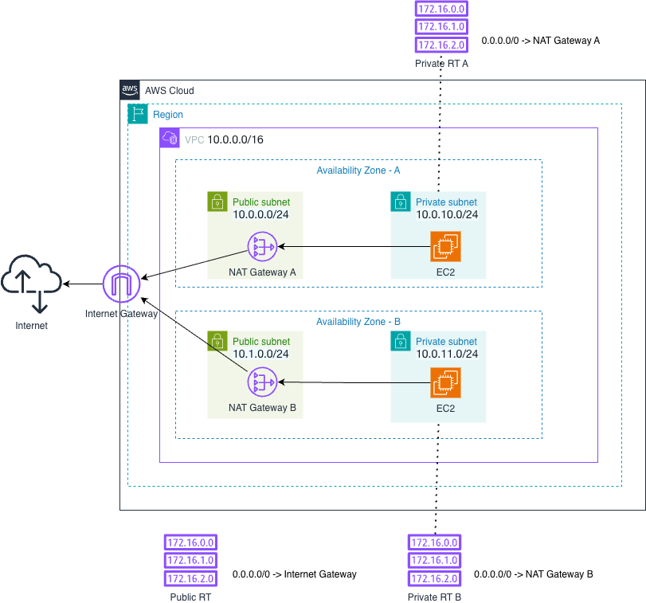
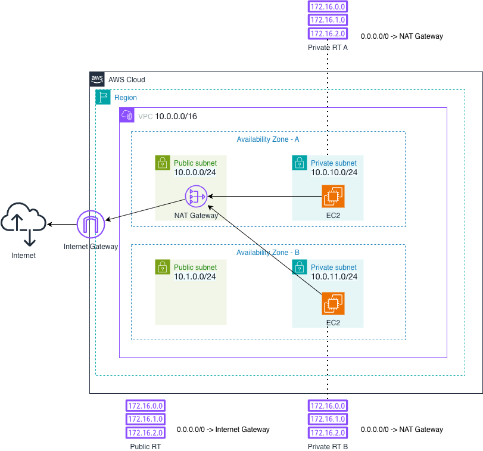

# Network (Terraform Unit)

This Terraform unit provisions a VPC networking baseline similar to the AWS Console “VPC and more” workflow:

- VPC
- 2+ AZs (configurable)
- Public subnets
- Private subnets
- Internet Gateway (IGW)
- Public route table with default route to IGW
- Per-AZ private route tables with optional default route to a NAT Gateway
- Default security group locked down (no open ingress/egress by default)

## Folder layout

```text
terraform/network/
├── main.tf
├── variables.tf
├── outputs.tf
├── nat_gateway.tf
├── local.tf
├── backends/
│   ├── dev.hcl
│   ├── staging.hcl
│   └── prod.hcl
└── envs/
    ├── common.tfvars
    ├── dev.tfvars
    ├── staging.tfvars
    └── prod.tfvars
```

## NAT Gateway modes

NAT creation and routing are controlled by:

- `enable_nat_gateway`
  - `true`: creates NAT Gateway resources and adds `0.0.0.0/0` routes in private route tables to NAT
  - `false`: does not create NAT Gateways and does not add private default routes to NAT
- `single_nat_gateway` (only effective when `enable_nat_gateway=true`)
  - `true`: creates exactly one NAT Gateway and routes all private route tables to it
  - `false`: creates one NAT Gateway per AZ and routes each private route table to the NAT in the same AZ

### Per-AZ NAT (HA)



### Single NAT Gateway (Cost-Optimized)



## Usage

Create a `.env` file from `.env.sample`, and update the variables as needed.

```bash
cp .env.sample .env
```

### Using just (recommended)

From repo root:

```bash
# Plan
TF_UNIT=network TF_ENV=dev just plan

# Apply the plan
TF_UNIT=network TF_ENV=dev just apply

# Destroy the resources
TF_UNIT=network TF_ENV=dev just quick-destroy
```

### Using terraform directly

From repo root:

```bash
cd terraform/network
terraform init -reconfigure \
  -backend-config=backends/dev.hcl \
  -backend-config="bucket=$TF_STATE_BUCKET" \
  -backend-config="profile=$AWS_PROFILE"

terraform plan \
  -var-file=envs/common.tfvars \
  -var-file=envs/dev.tfvars
```

## Outputs

Key outputs:

- `vpc_id`
- `public_subnet_ids`
- `private_subnet_ids`
- `nat_gateway_ids`
